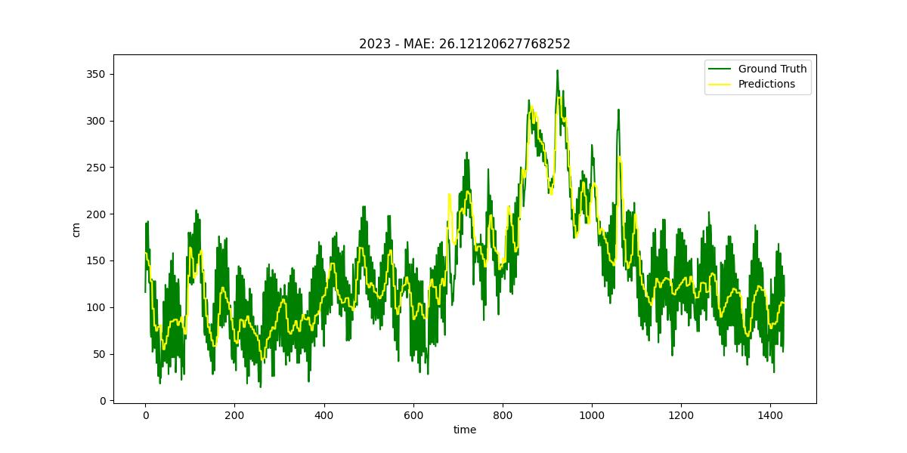
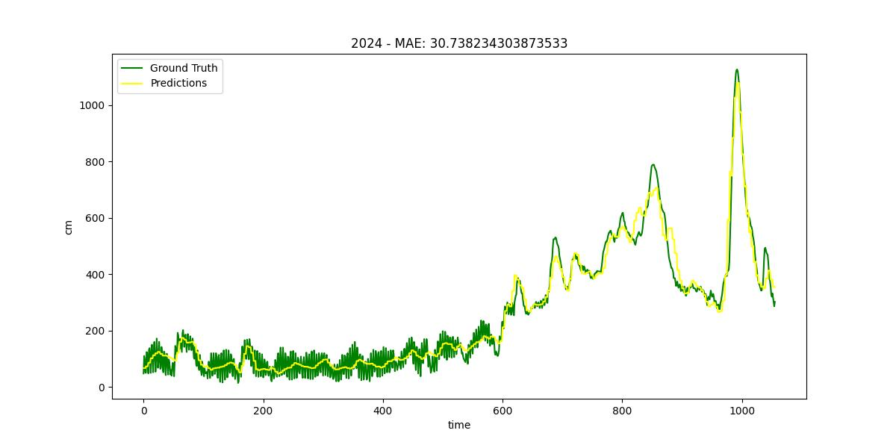

# **Flood - Water Level Prediction**

## **Overview**
This project predicts water levels at gauge stations for the upcoming days using historical data from these stations and discharge station information.

## **Setup**

### **1. Clone the Repository**
    git clone https://github.com/huynhspm/Flood.git

### **2. Install Required Packages**
    cd Flood
    conda create -n flood python=3.10
    conda activate flood 
    pip install -r requirements.txt

### **3. Training**
Before starting training, make sure to configure the following environment variables:

- **`CUDA_VISIBLE_DEVICES`**: Specifies the GPU(s) to use.  
- **`WANDB_API_KEY`**: Required for Weights & Biases logging (replace `???` with your API key).  

Run the following commands to set up the environment and start training:

    export CUDA_VISIBLE_DEVICES=0
    export WANDB_API_KEY=???
    python3 src/train.py experiment=flood

### **4. Inference**

Input data must follow the format of the provided example files (`9day.xlsx`, `month.xlsx`, `year.xlsx`) in the `results` folder.

Use the following command to perform inference. The output will be saved in the `results` folder:

    python3 src/inference --input <path_to_input_file> --ckpt <path_to_checkpoint_file>

Example inference:

    python3 src/inference --input results/year.xlsx --ckpt weights/not_training_2024.ckp

## **Result**

  
  

